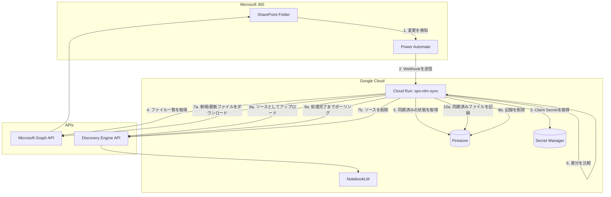

# SharePoint to NotebookLM Sync

## 概要

このアプリケーションは、指定されたSharePoint Onlineのフォルダからファイルを読み取り、Google NotebookLM Enterpriseの特定のノートブックにソースとして同期するためのCloud Runサービスです。

差分同期をサポートしており、SharePointフォルダ内のファイルの追加・削除を検知し、NotebookLMの状態をそれに追従させます。

## アーキテクチャ

- **Cloud Run**: アプリケーション本体がデプロイされるサーバーレスのコンテナ環境です。
- **SharePoint Online**: 同期の元となるファイルの保管場所です。Microsoft Graph API経由でアクセスします。
- **NotebookLM Enterprise**: 同期先となるノートブックです。Discovery Engine API経由で操作します。
- **Firestore**: 同期済みのファイルの状態を記録するためのデータベースです。どのファイルがNotebookLMに存在するかを追跡し、差分同期を実現します。

## アーキテクチャ図 (Mermaid)



### 認証
- **Microsoft Graph API**: OAuth 2.0のクライアント認証情報フローを使用します。クライアントシークレットはGoogle Secret Managerに保存され、環境変数経由で読み込まれます。
- **Google Cloud (NotebookLM & Firestore)**: Cloud Runにアタッチされたサービスアカウントを使用します。特にNotebookLM APIはユーザー権限が必要なため、ドメイン全体の委任（DWD）を構成し、サービスアカウントが指定されたユーザーを偽装してAPIを呼び出します。

## コードコンポーネント

- `main.py`: メインのFlaskアプリケーション。`/sync`エンドポイントと、中核となる差分同期のロジックを実装しています。
- `sharepoint_client.py`: Microsoft Graph APIとのすべての通信を担い、SharePointフォルダ内のファイル一覧取得や、ファイル内容のダウンロードを行います。
- `notebooklm_client.py`: Discovery Engine APIとのすべての通信を担い、NotebookLMソースの作成、状態取得、削除を行います。
- `firestore_client.py`: Firestoreとの通信を管理し、同期済みファイルのレコードを追加、取得、削除することで同期状態を管理します。
- `config.py`: SharePointのサイトID、フォルダID、NotebookLMのノートブックID、Google Cloudのプロジェクト番号など、各種設定値を一元管理します。
- `Dockerfile`: Cloud Runにデプロイするためのコンテナイメージを定義します。
- `requirements.txt`: Pythonの依存ライブラリをリストします。

## 動作の仕組み（同期ロジック）

1.  外部からの`POST`リクエストによって`/sync`エンドポイントが呼び出されます。
2.  SharePointから、現在同期対象フォルダにあるファイルのリストを取得します。
3.  Firestoreから、既に同期が完了しているファイルのリストを取得します。
4.  上記2つのリストをファイル名をキーにして比較し、差分を検出します。
5.  **新規ファイル**: SharePointに存在し、Firestoreに記録がないファイルは、新規アップロード対象となります。
6.  **非同期アップロードとポーリング**: NotebookLMへのファイルアップロードAPIは非同期です。ファイル送信後、アプリケーションはソースの状態取得APIを定期的に（6秒おきに最大10回）呼び出し（ポーリング）、バックグラウンド処理が`COMPLETE`（完了）または`FAILED`（失敗）になるのを確認します。
7.  **状態の更新**: ポーリングの結果、ソースの処理が正常に完了した場合のみ、そのソースの情報（NotebookLM上でのリソース名や表示名など）をFirestoreに記録します。
8.  **削除されたファイル**: Firestoreに記録があるにもかかわらず、SharePointにファイルが存在しない場合、そのファイルは削除されたと判断されます。NotebookLM上のソースを削除し、Firestoreのレコードも削除します。

---

## デプロイ手順

このアプリケーションをCloud Runにデプロイするには、以下の手順を実行します。

1.  **プロジェクトディレクトリに移動:**
    ```bash
    cd /home/admin_sryo_altostrat_com/spo-nlm-python
    ```

2.  **コンテナイメージをビルドし、Container Registryにプッシュ:**
    ```bash
    gcloud builds submit --tag gcr.io/$(gcloud config get-value project)/spo-nlm-sync
    ```

3.  **Cloud Runサービスをデプロイ:**
    ```bash
    gcloud run deploy spo-nlm-sync \
      --image gcr.io/$(gcloud config get-value project)/spo-nlm-sync \
      --platform managed \
      --region us-central1 \
      --set-secrets="SHAREPOINT_CLIENT_SECRET=spo-nlm-client-secret:latest" \
      --allow-unauthenticated \
      --memory 1Gi
    ```

## 手動での同期トリガー

デプロイされたCloud Runサービスは、HTTP POSTリクエストを受信することで同期処理を開始します。手動で同期をトリガーするには、以下の`curl`コマンドを使用します。

```bash
curl -X POST -w '\nHTTP Status: %{http_code}\n' https://YOUR_CLOUD_RUN_SERVICE_URL/sync
```

-   `YOUR_CLOUD_RUN_SERVICE_URL`は、Cloud Runサービスをデプロイした際に払い出されるURLに置き換えてください。

## DWD (Domain-Wide Delegation) 設定

NotebookLM APIはユーザー権限でのみ操作可能なため、サービスアカウントがユーザーアカウントを偽装するドメイン全体の委任（DWD）を設定する必要があります。

1.  **サービスアカウントの作成:**
    Cloud Runサービスにアタッチするサービスアカウント（例: `spo-nlm-sync@<PROJECT_ID>.iam.gserviceaccount.com`）がDWD用に設定されていることを確認します。通常、Cloud Runのデフォルトサービスアカウントを使用します。

2.  **ドメイン全体の委任の有効化:**
    Google Cloud Consoleで、該当のサービスアカウントの「詳細」ページに移動し、「ドメイン全体の委任を有効にする」オプションをチェックします。有効化後、表示される「クライアントID」をコピーします。

3.  **Google Workspace Admin Consoleでの設定:**
    Google Workspaceの管理者として、Admin Consoleにログインします。
    -   「セキュリティ」->「APIの制御」->「ドメイン全体の委任」に移動します。
    -   「新しいクライアントIDを追加」をクリックし、コピーしたクライアントIDを貼り付けます。
    -   以下のOAuthスコープを付与します（NotebookLM APIの要件に応じて調整してください）。
        -   `https://www.googleapis.com/auth/cloud-platform`

4.  **サービスアカウントへの権限付与:**
    DWDでJWTに署名するために、Cloud Runサービスアカウント自身に`roles/iam.serviceAccountTokenCreator`ロールが付与されていることを確認します。

---

## 今後の改善点 (TODO)

### サブフォルダの再帰的な同期

- **現在の制約:**
  現在の実装では、`config.py`で指定された単一のフォルダの直下にあるファイルのみを同期対象としており、そのサブフォルダ内は探索されません。

- **変更手法の提案:**
  1.  **`sharepoint_client.py`の修正:** Microsoft Graph APIの`/children`エンドポイントの代わりに、再帰的な検索が可能な`/search(q='')`エンドポイントを使用するように`list_files`関数を修正します。これにより、指定されたフォルダ配下のすべてのアイテムを一度に取得できます。
  2.  **同期キーの変更:** 現在、同期のキーとして単純なファイル名(`name`)を使用していますが、これでは異なるサブフォルダに存在する同名ファイルを区別できません。このキーを、ルートフォルダからの「**相対パス**」に変更する必要があります。Graph APIから取得した各アイテムの`parentReference`を辿るか、レスポンスに含まれるパス情報を使って、この相対パスを構築します。
  3.  **`main.py`および`firestore_client.py`の修正:** 上記で作成した「相対パス」を新しいキーとして、ファイルの比較、Firestoreへの記録（ドキュメントIDとして使用）、削除のロジックを修正します。NotebookLMに表示される名前も、このパスを含んだものにすることで、どのフォルダのファイルであるかが明確になります。

### Power Automateによる自動トリガー

- **目的:** SharePointでファイルが変更された際に、手動での`/sync`エンドポイント呼び出しではなく、自動的に同期処理を開始するようにします。
- **実装方法:** Power Automateフローを設定し、SharePointの特定のフォルダでのファイル変更イベントをトリガーとして、Cloud Runサービスの`/sync`エンドポイントにWebhook（HTTP POSTリクエスト）を送信するように構成します。

## 考慮が必要な事項

この同期ソリューションを運用する上で、以下の点について考慮が必要です。

### DWD (Domain-Wide Delegation) のImpersonationアカウントの分散

-   **課題**: 現在のDWD設定では、`config.py`で指定された単一のユーザーアカウントを偽装しています。もし、複数のユーザーがそれぞれ自身の権限でNotebookLMを操作する必要がある場合、この単一のImpersonationアカウントでは対応できません。
-   **考慮点**: 
    -   **単一アカウントでの運用**: 全てのNotebookLM操作を単一のImpersonationアカウントで行う場合、セキュリティ監査やアクセス制御の面で課題が生じる可能性があります。
    -   **複数アカウントでの運用**: 呼び出し元のユーザーに応じて、動的にImpersonationするアカウントを切り替える仕組みを導入する必要があります。これは、ユーザー管理の複雑性を増し、追加の認証ロジックが必要となります。
    -   **NotebookLMのAPI制限**: NotebookLMのAPIは、ユーザー権限でのみソースの作成・管理が可能です。サービスアカウントによる直接的な操作はサポートされていません。

### Teamsのメンバー変更とNotebookLMの共有範囲の同期

-   **課題**: Teamsのメンバーシップが変更された際に、それに合わせてNotebookLMの共有設定（アクセス権限）を自動的に更新する仕組みは、現在のソリューションには含まれていません。
-   **考慮点**: 
    -   **手動での管理**: Teamsのメンバー変更のたびに、NotebookLMの共有設定を手動で更新するのは非効率的で、ミスが発生しやすいです。
    -   **自動化の検討**: Power AutomateやAzure Functionsなどを用いてTeamsのメンバー変更イベントを検知し、Cloud RunサービスをトリガーしてNotebookLMの共有設定を更新する仕組みを検討する必要があります。これには、NotebookLM APIの共有管理機能の調査と実装が必要です。

### SharePoint Onlineのスロットリング

-   **課題**: 大量のファイル変更や大規模な同期処理を行う際、Microsoft Graph APIがSharePoint Onlineのスロットリング制限に抵触する可能性があります。スロットリングが発生すると、APIリクエストが一時的に拒否され、同期処理が遅延したり失敗したりする原因となります。
-   **考慮点**: 
    -   **リトライロジック**: スロットリングエラー（HTTP 429 Too Many Requests）が発生した場合に、指数バックオフ（Exponential Backoff）を伴うリトライロジックを実装することが必須です。
    -   **API呼び出しの最適化**: 可能な限りバッチ処理を利用したり、必要なデータのみを取得するようにクエリを最適化したりすることで、API呼び出しの回数を減らすことができます。
    -   **イベント駆動型への移行**: Power Automateの変更検知機能とWebhookを組み合わせることで、ポーリングではなく変更イベント発生時にのみ同期処理を実行し、API呼び出しの頻度を最小限に抑えることができます。

### NotebookLMの上限の考慮

-   **課題**: NotebookLMには、ユーザーあたり500ノートブックという上限があります。もし、TeamsのチャネルごとにNotebookLMのノートブックを作成するような運用を想定している場合、この上限に達する可能性があります。
-   **考慮点**: 
    -   **ノートブックの設計**: 1つのノートブックに複数のチャネルのソースをまとめる、あるいは特定の基準でノートブックを分割するなどの設計戦略が必要です。
    -   **ライフサイクル管理**: 古いノートブックのアーカイブや削除など、ノートブックのライフサイクル管理を検討する必要があります。

### 新規Teams/チャネル作成時のNotebook作成とSharePoint変更監視の自動化

-   **課題**: 新しいTeamsチームやチャネルが作成された際に、それに紐づくNotebookLMノートブックの作成、およびSharePointフォルダの変更監視（Webhookサブスクリプションなど）の設定は、現在のソリューションでは手動で行う必要があります。
-   **考慮点**: 
    -   **イベント検知**: Microsoft Graph APIのサブスクリプション機能（Webhooks）やPower Automateを用いて、TeamsやSharePointの作成イベントを検知する仕組みを構築します。
    -   **自動プロビジョニング**: イベント検知後、Cloud Runサービスをトリガーし、NotebookLM APIを介して新しいノートブックを自動作成し、SharePointの新しいフォルダに対する変更監視（Webhookサブスクリプション）を自動で設定するロジックを実装します。
    -   **設定の自動化**: `config.py`のような設定ファイルではなく、動的に設定を管理する仕組み（例: Firestoreに設定を保存）が必要になる可能性があります。
